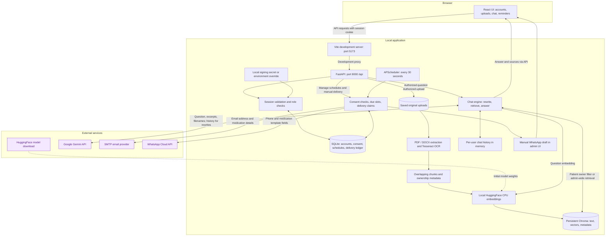
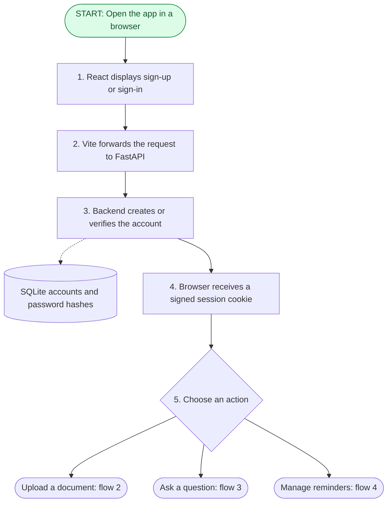
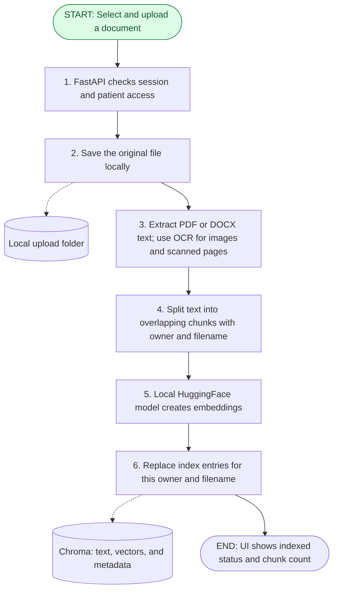
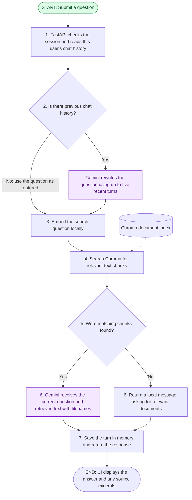
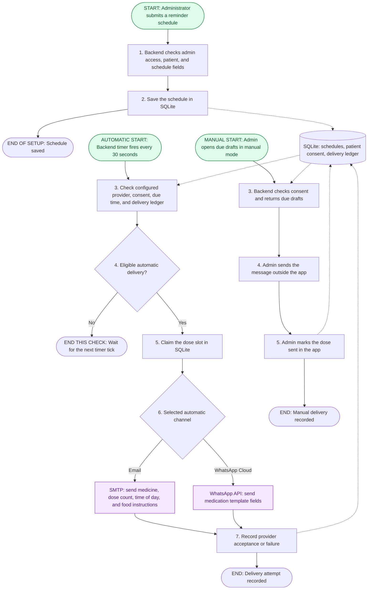

# Application architecture and flows

This document has two levels: a **high-level architecture** showing how the components connect, followed by **four detailed flows** showing how the application is used:

1. Open the app and sign in.
2. Upload and index a document.
3. Ask a question and receive an answer.
4. Configure and deliver reminders.

## High-level architecture

Use this overview to locate the browser, backend, storage, and external services. Its arrows show component connections and data exchange, not a single execution sequence. For a starting point and step-by-step order, follow the four flow diagrams below.

## Four application flows

**Start here:** a person opens the app and signs in through flow 1. They then choose to upload a document (flow 2), ask a question (flow 3), or manage reminders (flow 4). These are separate flows, not one continuous pipeline. Automatic reminders have their own starting point within flow 4: the backend timer.

Read each diagram **from top to bottom**, following the numbered steps and labeled arrows. Rounded **START** and **END** boxes mark the boundaries. Cylinders represent stored data; purple boxes represent external services. All labels are generic and contain no personal data or credentials.

### Flow 1. Entry point: open the app and sign in

Invalid credentials return an error instead of a session. The first registered account becomes the administrator; later accounts are patients. Subsequent protected requests include the session cookie. FastAPI verifies the session and applies role checks before performing the requested action. Vite is the proxy during local development only.

### Flow 2. Upload: turn a document into searchable text

**Starting action:** the patient selects a file, or the administrator selects a patient and a file.

This is the successful upload path. Unsupported files, extraction failures, and empty documents return a status to the UI. Reindex starts from the saved file at step 3. The embedding model is downloaded from HuggingFace on first use and then cached locally. Upload indexing does not call Gemini.

### Flow 3. Chat: retrieve relevant text and generate an answer

**Starting action:** the signed-in user types a question after uploading a document.

Patients search only their own documents. Administrator searches span all patients' records, even when a patient is selected for uploading. History holds up to 20 turns per user in backend memory and disappears on reset or process restart. A follow-up can make two Gemini calls: one to rewrite the question and another to generate the answer.

### Flow 4. Reminders: configure a schedule, then deliver when due

**Starting action:** an administrator enters a schedule. **Later trigger:** the backend timer checks schedules every 30 seconds. Manual WhatsApp drafts are requested separately through the administrator UI.

Email and WhatsApp each require separate patient consent. The backend must keep running for automatic sends. The ledger reduces duplicate attempts, but provider acceptance does not confirm receipt or guarantee exactly-once delivery. Patients can stop their own schedules; administrators can stop any schedule.

## Storage and external boundaries

| Component | Role in the flows |
| --- | --- |
| React UI | Starting point for sign-in, uploads, chat, and schedule management |
| Vite / FastAPI | Development request routing / backend processing and access checks |
| SQLite | Accounts, salted password hashes, consent, schedules, and delivery records |
| Upload folder | Original documents used for extraction and reindexing |
| Chroma | Extracted text, embeddings, filenames, timestamps, and owner identifiers |
| Backend memory | Per-user chat history and rate-limit state |
| Local signing secret or environment override | Signs and validates session cookies |
| HuggingFace | Initial embedding-model download; embeddings are computed locally |
| Gemini | External question rewriting and answer generation |
| SMTP / WhatsApp Cloud | Optional external reminder delivery |

The local components do not imply offline operation. Gemini receives questions, retrieved excerpts with filenames, and recent history for rewrites. SMTP receives the recipient email, medicine name, scheduled dose count, time of day, and food instructions; WhatsApp Cloud receives the phone number and medication template parameters. Dependency telemetry is not represented or audited.

Uploads and databases are not encrypted at rest by the application. SQLite and the generated signing secret use `backend/data/`; upload and Chroma paths are configurable. Backups can contain sensitive data and belong outside shared artifacts.

Use one backend process for the current in-memory state and scheduler lifecycle. A deployed static frontend needs API routing equivalent to the development proxy and updates to the backend's allowed origins.

See the [README](../README.md) for setup, configuration, and privacy details.
